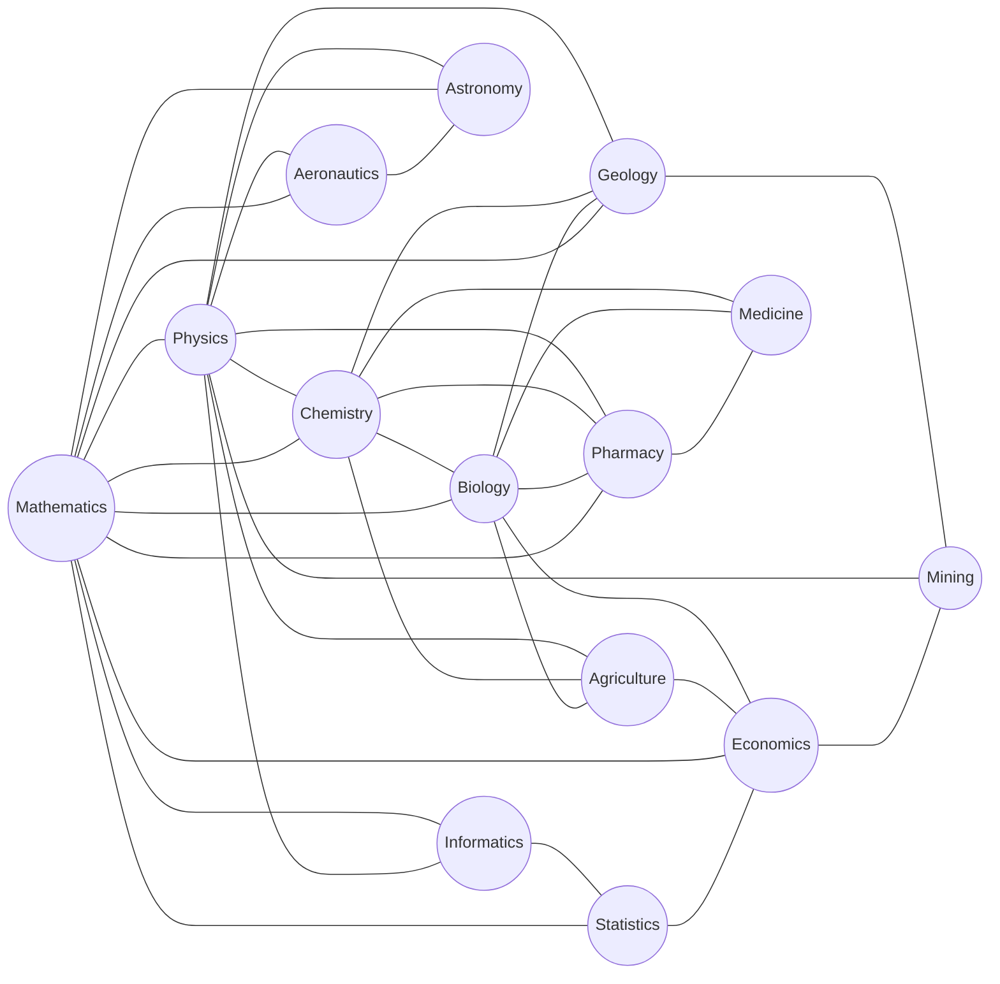

# moparc
map of physics and related concepts

## fields

## refs
+ [HyperPhysics](http://hyperphysics.phy-astr.gsu.edu/hbase/index.html)
+ [The Map of Physics](https://sway.com/s/aMXrEmvcK5q9PV6v/embed)
+ [PhySH](https://physh.org/)
