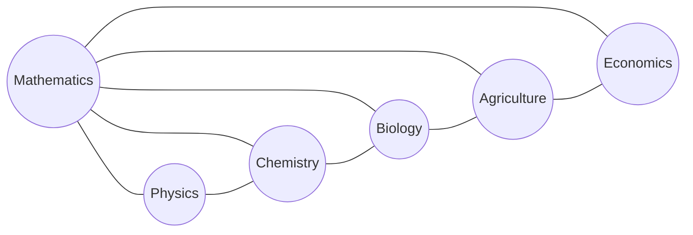

# maps
relation of some fields

## fields

+ Above version [41f92d49b2](https://github.com/dudung/moparc/tree/41f92d49b2)
+ Version with Astronomy [c6ec2ac255](https://github.com/dudung/moparc/tree/c6ec2ac255)
+ Version with other fields [bdda87f4e3](https://github.com/dudung/moparc/tree/bdda87f4e3)

## refs
+ [HyperPhysics](http://hyperphysics.phy-astr.gsu.edu/hbase/index.html)
+ [The Map of Physics](https://sway.com/s/aMXrEmvcK5q9PV6v/embed)
+ [PhySH](https://physh.org/)
