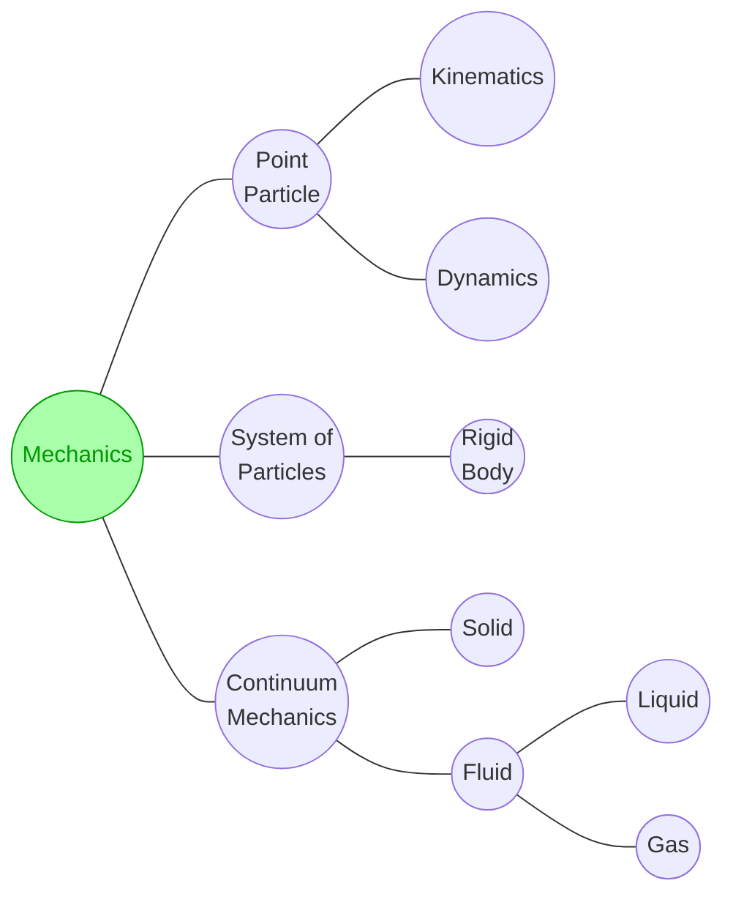

# mech
mechanics

## refs
1. Robert A LaBudde, Donald Greenspan, "Discrete mechanics—A general treatment", Jurnal of Computational Physics [J Comput Phys], vol 15, no 2, p 134-167, Jun 1974, url <https://doi.org/10.1016/0021-9991(74)90081-3>.
2. Wei-qiu Chen, "The renaissance of continuum mechanics", Journal of Zhejiang University SCIENCE A [ J Zheijang Univ-Sci],  vol 15, no, p 231–240,  Apr 2014, url <https://doi.org/10.1631/jzus.A1400079>.
3. Olaf Etzmuss, Joachim Gross, Wolfgang Strasser, "Deriving a particle system from continuum mechanics for the animation of deformable objects," IEEE Transactions on Visualization and Computer Graphics [IEEE Trans Vis Comput Graph], vol 9, no 4, p 538-550, Oct-Dec 2003, url <https://doi.org/10.1109/TVCG.2003.1260747>.