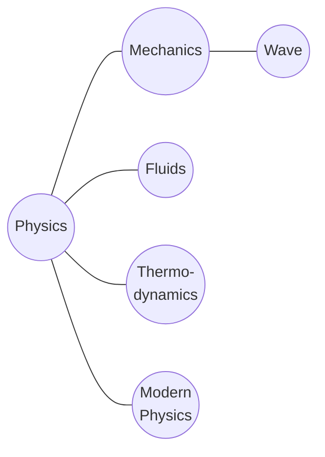

# phys
physics

```mermaid
flowchart LR
  %% links
  phys --- mech & flui & ther & mode
  mech --- wave
  %% elements
  phys(( Physics ))
  mech(( Mechanics ))
  flui(( Fluids ))
  ther(( Thermo-<br>dynamics ))
  wave(( Wave ))
  mode(( Modern<br>Physics ))
  %% pages
  %% styles
```