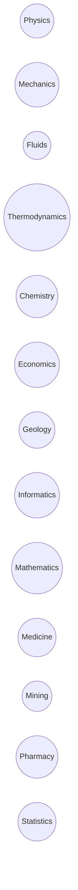

# phys
physics

```mermaid
flowchart LR
  %% links
  %% elements
  phys(( Physics ))
  mech(( Mechanics ))
  flui(( Fluids ))
  ther(( Thermodynamics ))
  chem(( Chemistry ))
  econ(( Economics ))
  geol(( Geology ))
  info(( Informatics ))
  math(( Mathematics ))
  medi(( Medicine ))
  mine(( Mining ))
  phar(( Pharmacy))
  phys(( Physics ))
  stat(( Statistics ))
  %% pages
  click aero "https://github.com/dudung/moparc/tree/main/aero" _self
  click agri "https://github.com/dudung/moparc/tree/main/agri" _self
  click astr "https://github.com/dudung/moparc/tree/main/astr" _self
  click biol "https://github.com/dudung/moparc/tree/main/biol" _self
  click chem "https://github.com/dudung/moparc/tree/main/chem" _self
  click econ "https://github.com/dudung/moparc/tree/main/econ" _self
  click geol "https://github.com/dudung/moparc/tree/main/geol" _self
  click geol "https://github.com/dudung/moparc/tree/main/info" _self
  click math "https://github.com/dudung/moparc/tree/main/math" _self
  click medi "https://github.com/dudung/moparc/tree/main/medi" _self
  click mine "https://github.com/dudung/moparc/tree/main/mine" _self
  click phar "https://github.com/dudung/moparc/tree/main/phar" _self
  click phys "https://github.com/dudung/moparc/tree/main/phys" _self
  click stat "https://github.com/dudung/moparc/tree/main/stat" _self
  %% styles
```